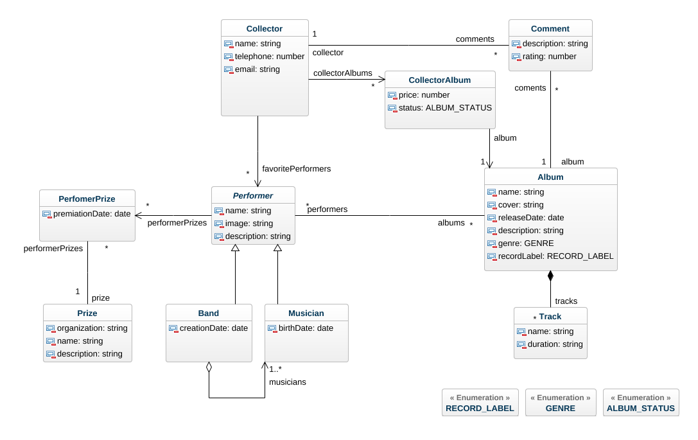

## Generalidades del proyecto

Este curso gira alrededor de un proyecto de desarrollo de software. Se espera que los estudiantes adquieran conocimientos y desarrollen habilidades mientras avanzan en él.

El proyecto se hace en equipos de 2 - 3 estudiantes. El producto que se debe construir está conformado por una aplicación web que se integra con un _Back-end_ existente mediante una interface de servicios. La aplicación se espera que sea semejante a muchas existentes y utilizadas de manera regular por miles de personas en el mundo.

Los retos a los que el grupo se enfrenta son similares a los que debe abordar un grupo de desarrollo en el mundo real.

Los estudiantes tendrán que rendir cuentas tanto por su trabajo individual como por su contribución, colaboración y soporte en el equipo. El éxito de cada estudiante depende de la terminación exitosa del producto y en la evidencia del buen funcionamiento del equipo.

Cada semana el estudiante debe realizar actividades de manera autónoma para las que se dispone de un conjunto de recursos en línea que le permitirán avanzar en ellas. Durante la sesión síncrona se aclararán dudas y se trabajará en cómo los conceptos se incorporan en el proyecto. El equipo trabajará en el seguimiento y planeación del proyecto y el profesor dará retroalimentación sobre los avances.

## Enunciado del proyecto

Pese al auge de las plataformas digitales de música como iTunes o Spotify, existe un creciente grupo de personas que prefieren escuchar música en formatos tradicionales como los discos en vinilo. Es por esta razón que se quiere desarrollar una aplicación que proporcione al coleccionista aficionado la posibilidad de adquirirlos nuevos o usados, ya sea mediante compra o intercambio.

Se espera que por medio de este sistema los coleccionistas puedan comprar, vender o intercambiar álbumes.

Un coleccionista registrado puede ser comprador, vendedor o ambos. La información del registro debe incluir su nombre, información de contacto (teléfono y correo electrónico) la cual es privada para el sistema, y sus artistas favoritos

La funcionalidad principal de la aplicación es permitir que un coleccionista que cumpla el rol de vendedor pueda registrar los álbumes que tiene para vender o hacer trueque; y quien cumpla el rol de comprador, pueda realizar la compra o el intercambio.

La aplicación debe ser muy llamativa para los usuarios visitantes e incluir una galería en donde sea fácil filtrar y buscar por distintos criterios como el nombre del album, del artista, de la casa discográfica o del género.

Cada álbum debe caracterizarse por un nombre, la imagen de la carátula, la fecha de salida al mercado, una descripción, el género, la casa discográfica, el artista (o lista de artistas) y el listado de tracks. Los usuarios registrados en la aplicación pueden hacer comentarios sobre los álbumes.

Del artista (que puede ser un solista o una banda) se requiere información como su nombre, una fotografía y un texto con una breve descripción. Si es una banda se debe concer la fecha de formación, mientras que si es un solista se requiere su fecha de nacimiento.

También es importante conocer los premios que ha recibido el artista y la organización que otorga los premios.

## Modelo conceptual

| Concepto       | Descripción                                                                                                                                                                                               |
| -------------- | --------------------------------------------------------------------------------------------------------------------------------------------------------------------------------------------------------- |
| Album          | Disco musical                                                                                                                                                                                             |
| ALBUM_STATUS   | Enumeración del estado de un árbol                                                                                                                                                                        |
| Collector      | Coleccionista registrado en la aplicación que puede publicar y comentar álbumes                                                                                                                           |
| CollectorAlbum | Clase de asociación entre el coleccionista y el álbum. Contiene información sobre los álbumes de coleccionista para venta o intercambio, en particular el precio y el estado (disponible o no disponible) |
| Comment        | Clase de asociación entre el coleccionista y el álbum. Contiene información sobre el contenido del comentario y el rating del álbum                                                                       |
| GENRE          | Enumeración de los géneros musicales                                                                                                                                                                      |
| Performer      | Artista que puede ser bien o una banda (Band) o un músico (Musician)                                                                                                                                      |
| PerformerPrize | Clase de asociación entre el artista y el premio. Guarda información sobre la fecha en la cual se le otorga el premio al artista                                                                          |
| Prize          | Premio que es otorgado por una organización a un artista                                                                                                                                                  |
| RECORD_LABEL   | Enumeración de los sellos discográficos                                                                                                                                                                   |
| Track          | Pista musical del álbum                                                                                                                                                                                   |

## Infraestructura

Para el desarrollo del proyecto se cuenta con la siguiente infraestructura:

### API REST

Los servicios que usará el front son provistos por un API REST que está previamente desarrollado. Las herramientas en las cuales está construido son:

| Elemento                 | Herramienta                               |
| ------------------------ | ----------------------------------------- |
| Base de datos            | Postgres                                  |
| Framework                | Nest.js                                   |
| Lenguaje de programación | Typescript                                |
| Repositorio              | https://github.com/TiCSw/mt1_vinilos_back |

#### Documentación del API

- [Álbum](https://documenter.getpostman.com/view/8840688/SzmZd1L6)
- [Álbum Banda](https://documenter.getpostman.com/view/8840688/SzmZd1QV)
- [Álbum Músico](https://documenter.getpostman.com/view/8840688/SzmZd1QW)
- [Banda](https://documenter.getpostman.com/view/8840688/SzmZd1Us)
- [Banda Álbum](https://documenter.getpostman.com/view/8840688/SzmZd1Ut)
- [Banda Músico](https://documenter.getpostman.com/view/8840688/SzmZd1Uu)
- [Coleccionista](https://documenter.getpostman.com/view/8840688/SzmZd1Ux)
- [Coleccionista Álbum](https://documenter.getpostman.com/view/8840688/SzmZd1Uy)
- [Coleccionista Artista](https://documenter.getpostman.com/view/8840688/SzmZd1Uz)
- [Comentarios](https://documenter.getpostman.com/view/8840688/SzmZd1V1)
- [Músico](https://documenter.getpostman.com/view/8840688/SzmZd1ZH)
- [Músico Álbum](https://documenter.getpostman.com/view/8840688/SzmZd1ZK)
- [Artista Premio](https://documenter.getpostman.com/view/8840688/SzmZd1ZL)
- [Premio](https://documenter.getpostman.com/view/8840688/SzmZd1ZM)
- [Tracks](https://documenter.getpostman.com/view/8840688/SzmZd1ZN)

### Front

El front será desarrollado usando el framework Angular. El lenguaje de programación será Typescript y se usarán otras herramientas que se intregan en Angular como Bootstrap y Toastr.

## Distribución del trabajo por semanas

El proyecto está dividido en 8 semanas de trabajo. Para realizar la planeación y el seguimiento, la semana de trabajo se toma desde el miércoles a las 0:00 horas hasta el martes de la próxima semana a las 23:59 horas. Por tanto, todos los entregables de cada actividad deberán estar disponibles antes de la hora de cierre en la wiki o en el repositorio del proyecto según corresponda.
